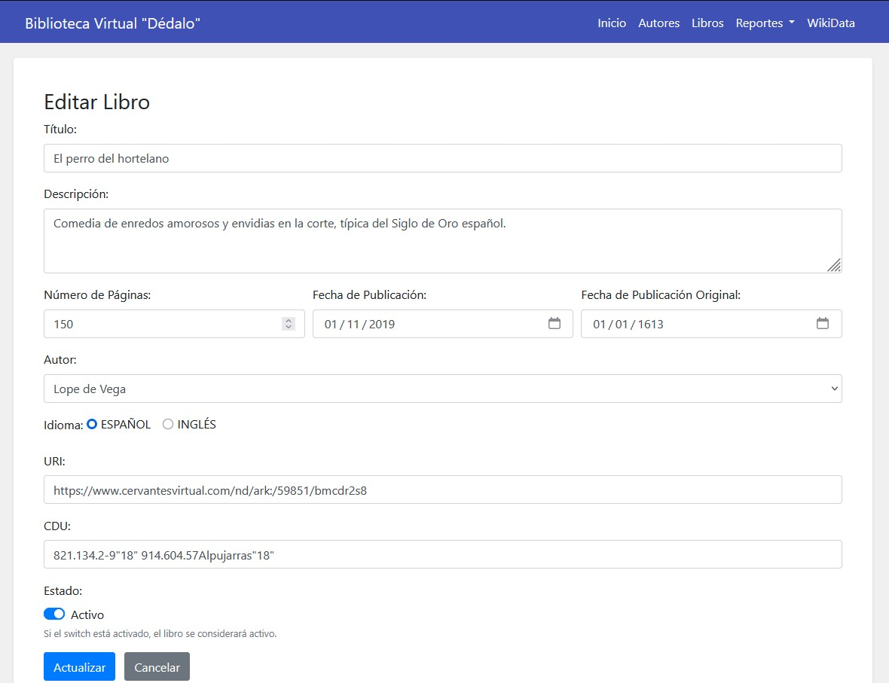

# Proyecto - Biblioteca Virtual "Dédalo"

**Autor:** Juan Fernando Rodríguez Mamani

## Descripción del Proyecto

Este proyecto se ha creado para la asignatura Tecnologías de Internet Orientadas al Navegador del Máster Universitario en Desarrollo de Aplicaciones y Servicios Web de la Universidad de Alicante.

Esta aplicación web ha sido desarrollada con SpringBoot, y permite gestionar información sobre autores y libros. La aplicación cuenta con interfaces creadas haciendo uso de Thymeleaf, Bootstrap y una estructura de layout y fragmentos. Además, incorpora funcionalidades adicionales como la generación de un reporte PDF y la integración con Wikidata para obtener información externa sobre libros y autores relacionados a la temática de ciencia ficción.

## Funcionalidades

- **CRUD de Autores:**  
  Permite crear, editar, eliminar y listar autores. Se puede adjuntar una imagen de perfil para cada autor, la cual se almacena en un directorio externo y se visualiza en la lista de autores con un marco circular.
  
   
  
  

   

  

   
  
- **CRUD de Libros:**  
  Gestiona la creación, edición, eliminación y listado de libros. Dentro del proceso de creación o edición, se cuenta con un combobox para seleccionar a un autor creado en el punto anterior.  

   

  

   

  

   

- **Reporte PDF:**  
  La aplicación genera un reporte PDF con la información de los libros registrados.  

   

  

   

- **Consulta a Wikidata:**  
  Se implementó un servicio que consulta Wikidata utilizando SPARQL para obtener información sobre autores vinculados a la Biblioteca Virtual Miguel de Cervantes y que tengan relación con el género de ciencia ficción. Los resultados se muestran en una tabla formateada, permitiendo filtrar los datos por idioma y límite de resultados.  

   

  

   
